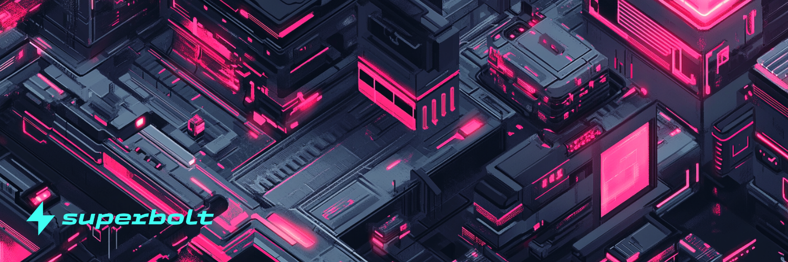

# Getting Started

Superbolt is an NFTfi protocol built around a best in class marketplace and launchpad. Our protocol is purpose built from the ground up. We have completely reimagined the mechanics of NFTfi, creating powerful new utilities for NFTs with deep DeFi functionality.

What this means in practice is it’s a place where Creators, Collectors, and Traders can come together and participate meaningfully. Creators can launch collections using the powerful yet easy to use Foundry launchpad. Collectors and Traders can mint NFTs with randomness assured. In addition there is a unified UI for both marketplace listed and fractionalised NFTs available from the liquidity pools.

## Wallet connection and supported networks

Superbolt is the flagship NFT platform on Neutron. To buy and sell NFTs and enagage with Superbolt NFTfi, one of the following supported wallets are required: Cosmostation, Keplr, or Leap.
