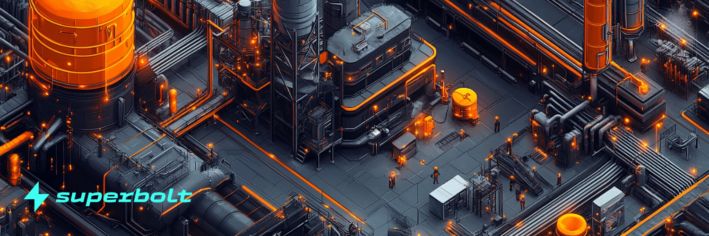

# Foundry
Innovative, no code NFT launchpad - ideal for both new and experienced creators. Superbolt Foundry launchpad is the easiest place to launch NFTs in web3 for both experienced NFT creators and first time users.

Superbolt enables projects to launch new NFT collections with our NFT Foundry.

This no-code solution removes the technical burden and dependency upon developers, typical of other launchpads.

Superbolt abstracts away the complexity of NFT minting and provides creators with the freedom to focus upon artistic development and community building. We want to help solve the complexity of onboarding to Cosmos and make Neutron the go to destination for artists to launch new collections.

The entire goal: *to make Neutron the easiest place in web3 to launch an NFT collection.*

Also, planned are integrations with DAO DAO and Superbolt Superpools, making it easy to onboard collections into NFTfi.

## How to upload an NFT collection to Foundry

Foundry is a no code platform for creators to easily bring NFT collections on-chain.

Discover how easy it is to upload NFT collections using Superbolt Foundry in the following video.

<iframe width="560" height="315" src="https://www.youtube.com/embed/wF76C2BqizA?si=b4MOME0-5YagBRu7" title="YouTube video player" frameborder="0" allow="accelerometer; autoplay; clipboard-write; encrypted-media; gyroscope; picture-in-picture; web-share" referrerpolicy="strict-origin-when-cross-origin" allowfullscreen></iframe>
