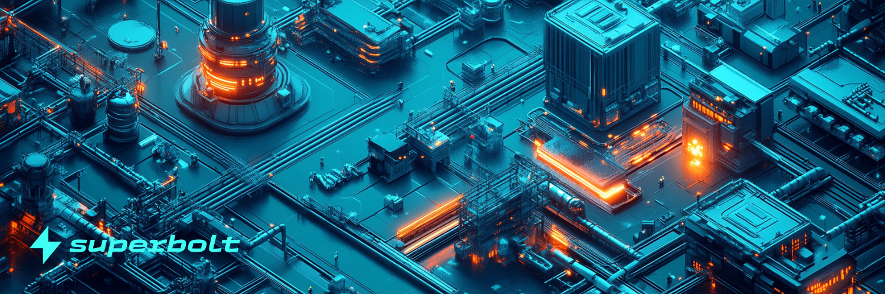

# Marketplace

Feature rich trading hub and gateway for NFT trading on Neutron. Superbolt is about much more than just a trading venue for NFTs. The marketplace is a flagship product with stunning UI and intuitive UX.

Superbolt provides a seamless, integrated market destination for collectors and traders to research and purchase NFTs on Neutron.

Our super clean marketplace UI/UX ensures that NFTs take centre stage. Multiple customisation options for users, including Gallery view for art lovers, List view for traders.

## Sending and listing NFTs

Superbolt makes it easy to send and list NFTs from Individual NFT pages. Whether you are transfering an NFT to another wallet or listing an NFT on the Marketplace, these actions are intuitive within the Superbolt GUI.

## Marketplace walkthrough

