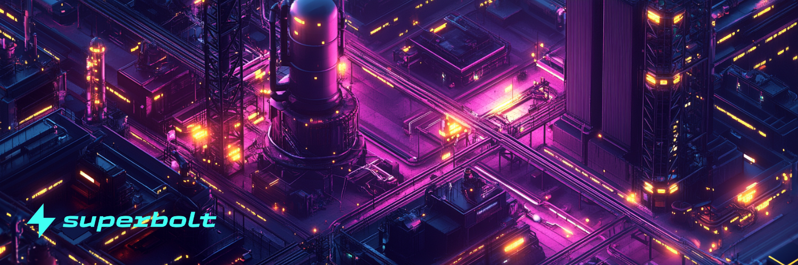

# Launchpad & Candy

Creators can choose from a variety of bespoke launch and mint variations to meet their goals, with everything configurable from the Foundry GUI. Simply upload a White List CSV, if necessary, and select mint and launch parameters.

## Gumball

Superbolt offers a sophisticated Gumball Machine mechanism to provide randomized minting. (similar to putting a coin into a real gumball machine and getting a random-colored gumball).

### How It Works:
Users Pay a Fixed Price – Just like inserting a quarter into a gumball machine, buyers pay a set token price.

Randomized Selection – The NFT they receive is randomly selected from a pre-determined collection.

Reveal Mechanism – Minting on Superbolt is a two stage process. This ensures mints cannot be gamed. Our two stage mint ensures everyone has equal opportunity to mint the rarest NFTs!

Fair Distribution – This method ensures fairness and can prevent buyers from cherry-picking rare NFTs before others through on chain queries (this is more common that you think!)

<video controls src="Superbolt minting.mov" title="Title"></video>

## Batch Minting

Superbolt smart contracts supports creator-defined Batch minting to allow minting multiple NFTs in a single transaction rather than one at a time. This can support:

Large-Scale NFT Drops – Ideal for collections like PFP projects (Profile Picture NFTs) or generative art drops.

Airdrops & Rewards – Used to distribute NFTs as rewards to multiple users at once.

