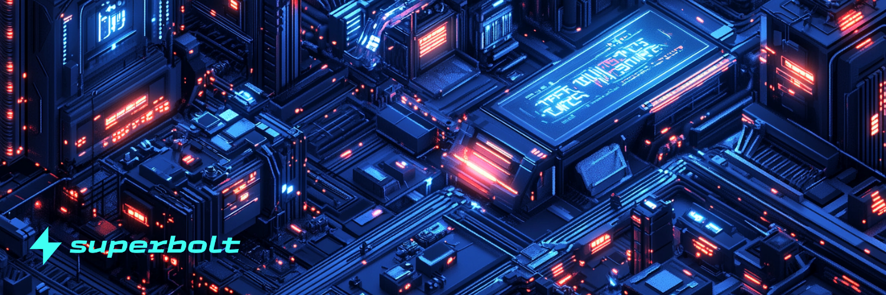

# Introduction

Welcome to Superbolt 🌩 — the lightning-fast NFT marketplace designed for the future of NFTfi.
At Superbolt, we believe that trading, owning, and earning with NFTs should be seamless, intuitive, and blazing fast. Whether you're a collector, creator, or DeFi power user, our platform empowers you to do more with your digital assets.

Built around the ve(3,3) model, Superbolt unlocks deeper utility for NFTs through staking, voting, and revenue sharing, while pioneering NFT fractionalization — allowing users to split high-value NFTs into tradable fractions. This is NFTfi made simple, powerful, and scalable.